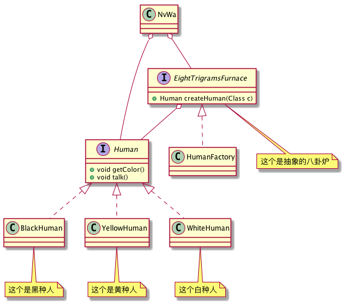
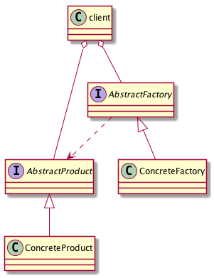
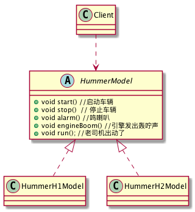

这个是读设计模式之禅的读书笔记

<!-- more -->

# 最重要的几个原则

# 设计模式开始前的准备

* 工具
* UML

# 3.单例模式
## 3.1 类图


## 3.2一个简单的例子
* 皇帝是一个只有一个，是单例
```
public class Emperor {
    private  static final Emperor emperor=new Emperor();
    private  Emperor(){};
    public  static Emperor getIntence(){
        return emperor;
    }
    public static void say(){
        System.out.println("我是皇帝xxx");
    }

}
```
* 臣子可以有多个，臣子朝拜皇帝

```
public class Minister {
    public static void main(String[] args) {
        for (int i = 0; i < 30; i++) {
            Emperor emperor=Emperor.getIntence();
            emperor.say();
        }
    }
}
```

## 3.3 单例模式的应用
### 3.3.1 优点
* 节约内存
* 资源共享

### 3.3.2 缺点
* 拓展困难
* 单例模式和单一职责原则冲突

## 3.4 单例模式的注意事项
### 并发问题
* 饿汉试
> 实现创建好，只要get就可以,下面就是一个典型的饿汉式
```

public class Emperor {
  private static final Emperor emperor = new Emperor();
   //初始化 一个 皇帝 private Emperor(){
//世俗 和 道德 约束 你， 目的 就是 不 希望 产生 第二个 皇帝
}
  public static Emperor getInstance(){
   return emperor;
  }
   //皇帝 发话 了
  public static void say(){
  System. out. println(" 我 就是 皇帝 某 某某....");
    }
}

```

* 懒汉式
> 用的时候创建，会发生多线程安全问题
```
public class Singleton {
   private static Singleton singleton = null;
    //限制 产生 多个 对象
     private Singleton(){
}
//通过 该 方法 获得 实例 对象
 public static Singleton getSingleton(){
   if( singleton == null){
      singleton = new Singleton();
      }
    return singleton;
    }
}

```

* 解决办法：
  * 使用饿汉式
  * 使用synchronized

## 3.5 单例模式的拓展
### 3.5.1 一个国家有两个皇帝
> 明朝的明英宗朱祁镇和他弟弟明景帝，弟弟忘了让哥哥当太上皇...(⊙o⊙)哦。出现了一国两个主人的情况。皇帝不是什么人想当就能当的，所以这个就是这个对象只可以创建两次，这个怎么处理。

### 3.5.2 类图


### 3.5.3 代码
* 皇帝

```
public class Emperor2 {
    //只有两个皇帝
    public static int maxSizeOfEmperor = 2;
    //创建一个集合用于存储两个皇帝,每个皇帝都有独一无二的名字
    private static ArrayList<Emperor2> emperor2s = new ArrayList<>();
    //创建当前皇帝的名称
    private static ArrayList<String> names = new ArrayList<>();
    //当前皇帝的数量
    private static int size = 0;


    static {

        for (int i = 0; i < maxSizeOfEmperor; i++) {
            emperor2s.add(new Emperor2("皇家" + i + "号"));
        }

    }

    private static int countNumOfEmperor;


    private Emperor2(String name) {
        names.add(name);
    }


    private Emperor2() {
    }

//随机 获得 一个 皇帝 对象
    public static Emperor2 getInstance() {
        Random random = new Random();
        //随机 拉出 一个 皇帝， 只要 是个 精神 领袖 就成
        countNumOfEmperor = random.nextInt(maxSizeOfEmperor);
        return emperor2s.get(countNumOfEmperor);
    }

    // 皇帝 发话 了
    public static void say() {
        System.out.println(names.get(countNumOfEmperor));
    }
}
```

* 臣子
> 没有什么变化

```
public class Minister {
    public static void main(String[] args) {
        for (int i = 0; i < 30; i++) {
            Emperor emperor=Emperor.getIntence();
            //为了更加清晰，加入这个：
            System. out. print(" 第"+( i+ 1)+" 个大 臣 参拜 的 是：");
            emperor.say();
        }
    }
}
```

* 结果
```
第 1 个大 臣 参拜 的 是： 皇 1 帝
第 2 个大 臣 参拜 的 是： 皇 2 帝
第 3 个大 臣 参拜 的 是： 皇 1 帝
第 4 个大 臣 参拜 的 是： 皇 1 帝
第 5 个大 臣 参拜 的 是： 皇 2 帝
```

## 3.6 拓展
> 单 例 模式 是 23 个 模式 中 比较 简单 的 模式， 应用 也非 常 广泛， 如在 Spring 中， 每个 Bean 默认 就是 单 例 的， 这样做 的 优点 是 Spring 容器 可以 管理 这些 Bean 的 生命 期， 决定 什么时候 创建 出来， 什么时候 销毁， 销毁 的 时候 要 如何 处理， 等等。 如果 采用 非 单 例 模式（ Prototype 类型）， 则 Bean 初始化 后的 管理 交由 J2EE 容器， Spring 容器 不再 跟踪 管理 Bean 的 生命 周期。


# 4.工厂方法模式
> 女娲造人的故事
> 女娲拿出他的八卦炉，然后采集黏土，第一天出炉晚了，造出了黑人。第二天，出炉早了，造出了白人。第三天，火候刚刚好，造出了又香又脆的黄种人...\(^o^)/~

## 4.1 就上面这个故事，来一波类图


## 4.2代码

* 人这个抽象的东西
```
public interface Human {
      void getColor();
     void tall();
}
```

人的具体实现
* 白人
```
public class WhiteHuman implements Human {
    @Override
    public void getColor() {
        System. out. println(" 白色 人白色");
    }

    @Override
    public void tall() {
        System. out. println(" 白色 人种 会 说话， 一般 都是 但是 单 字节。");

    }
}

```


* 黑人
```
public class BlackHuman implements Human {
    @Override
    public void getColor() {
        System. out. println(" 黑色 人黑色");
    }

    @Override
    public void tall() {
        System. out. println(" 黑色 人种 会 说话， 一般 都是 但是 单 字节。");

    }
}


```

* 黄种人

```
public class YellowHuman implements Human{
    @Override
    public void getColor() {
        System. out. println(" 黄色 人黄色");
    }

    @Override
    public void tall() {
         System. out. println(" 黄色 人种 会 说话， 一般 都是 但是 多 字节。");

    }
}

```

* 八卦炉的抽象
```
public abstract class EightTrigramsFurnace {

    public abstract <T extends Human> T createHuman(Class<T> tClass);

}

```

* 真正的先天至宝
```
public class HumanFactory extends EightTrigramsFurnace {
    @Override
    public <T extends Human> T createHuman(Class<T> tClass) {

        Human human= null;
        try {
            human = (Human) (tClass.forName(tClass.getName())).newInstance();
        } catch (InstantiationException e) {
            e.printStackTrace();
        } catch (IllegalAccessException e) {
            e.printStackTrace();
        } catch (ClassNotFoundException e) {
            e.printStackTrace();
        }
        return (T)human;
    }
}
```
* 女娲


```
public class NvWa {
    public static void main(String[] args) {
        EightTrigramsFurnace baGuaLu=new HumanFactory();
        //第一次造人
        WhiteHuman whiteHuman = baGuaLu.createHuman(WhiteHuman.class);
        whiteHuman.getColor();
        whiteHuman.tall();

        //第二次造人
        BlackHuman blackHuman = baGuaLu.createHuman(BlackHuman.class);
        blackHuman.getColor();
        blackHuman.tall();
        //第三次造人

        YellowHuman yellowHuman = baGuaLu.createHuman(YellowHuman.class);
        yellowHuman.getColor();
        yellowHuman.tall();
    }

}

```

* 结果

```
 白色 人白色
白色 人种 会 说话， 一般 都是 但是 单 字节。
 黑色 人黑色
 黑色 人种 会 说话， 一般 都是 但是 单 字节。
 黄色 人黄色
 黄色 人种 会 说话， 一般 都是 但是 多 字节。
```

## 4.3 工厂方法的定义和通用类图
### 4.3.1 定义
> 为创建一组相关或相互依赖的对象提供一个接口而且无须指定它们的具体类。




### 4.3.2 通用类图


**代码**

---
* AbstractProductA  抽象的产品
```
public abstract class AbstractProductA {
  //每个 产品 共有 的 方法
  public void shareMethod(){ }
  //每个 产品 相同 方法， 不同 实现
   public abstract void doSomething();
 }
```
* ProductA1  产品A1
```
public class ProductA1 extends AbstractProductA {
   public void doSomething() {
     System. out. println(" 产品 A1 的 实现 方法");
    }
  }
```
* ProductA2  产品A2
```
public class ProductA2 extends AbstractProductA {
   public void doSomething() {
      System. out. println(" 产品 A2 的 实现 方法");
    }
  }
```
* AbstractCreator 抽象创建者
```

public abstract class AbstractCreator {
  //创建 A 产品 家族
  public abstract AbstractProductA createProductA();
    //创建 B 产品 家族
  public abstract AbstractProductB createProductB();
}
```


* Creator1  创建者
```
public class Creator1 extends AbstractCreator {
//只 生产 产品 等级 为 1 的 A 产品
public AbstractProductA createProductA() {
 return new ProductA1();
 }
 //只 生产 产品 等级 为 1 的 B 产品
public AbstractProductB createProductB() {
   return new ProductB1();
   }
}
```
* Creator2
```

public class Creator2 extends AbstractCreator {
  //只 生产 产品 等级 为 2 的 A 产品
   public AbstractProductA createProductA()
    createProductA() { return new ProductA2();
       //只 生产 产品 等级 为 2 的 B 产品
       public AbstractProductB createProductB() {
         return new ProductB2();
  }
}
```

* Client
```
public class Client {
   public static void main( String[] args) {
     //定义 出 两个 工厂
  AbstractCreator creator1 = new Creator1();
  AbstractCreator creator2 = new Creator2();
  //产生 A1 对象
  AbstractProductA a1 = creator1. createProductA();
  //产生 A2 对象
   AbstractProductA a2 = creator2. createProductA();
  //产生 B1 对象
  AbstractProductB b1 = creator1.createProductB();
   //产生 B2 对象
    AbstractProductB b2 =creator2.createProductB();
   /* * 然后 在这里 就可以 为所欲为了... */
    }
  }

```

## 4.4 运用
### 4.4.1 优点
屏蔽对象创造的细节、可以添加产品内部约束
### 4.4.2缺点
拓展不方便，要拓展产品3，改动量特别大

# 5.模板方法模式
## 5.1类图


